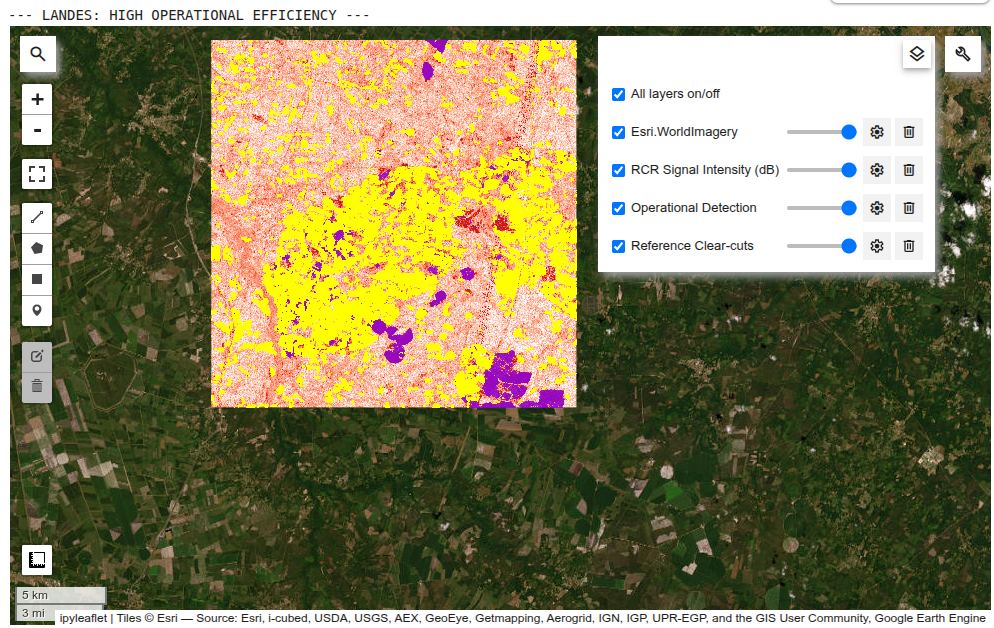
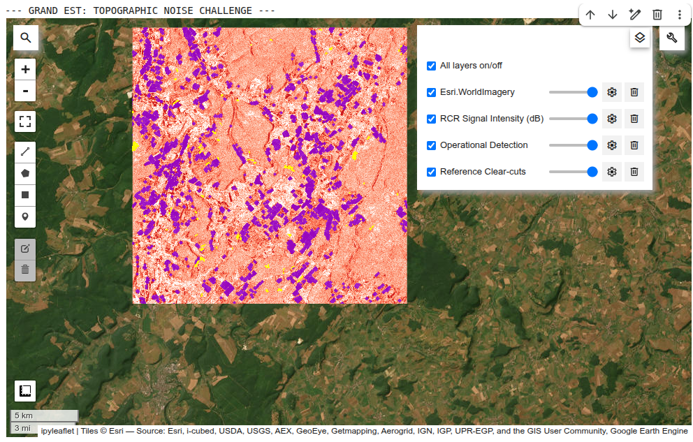

# Symbiose Technical Challenge: SAR-based Forest Disturbance Detection

> **Note:** If GitHub fails to render the notebook preview due to its size or GEE widgets, please click the **Open in Colab** button above or download the file to view it locally.

This repository contains the full codebase and technical report for the forest disturbance detection challenge. The project utilizes Sentinel-1 SAR data and Google Earth Engine to identify clear-cut events in two distinct French regions: Landes and Grand Est.

## 1. Setup & Instructions to Run
The entire pipeline is contained within the `Symbiose_Technical_Challenge.ipynb` notebook.

* **Online Viewing:** If the GitHub preview displays an "Invalid Notebook" error, click the **Open in Colab** badge at the top of this page.
* **Local Execution:** Download the `.ipynb` file and open it in your preferred environment (Jupyter, VS Code, etc.).

### Prerequisites
- A **Google Earth Engine (GEE)** account.
- Python environment with the following libraries: `ee`, `geemap`, `pandas`.

### How to Run
1. Open `Symbiose_Technical_Challenge.ipynb` in **Google Colab** or a local Jupyter environment.
2. Run the first cell to initialize the Earth Engine API and authenticate.
3. Execute all cells sequentially. The notebook is designed to automatically process the data for both Landes and Grand Est regions and display the final metrics and maps.

## 2. Methodology
The project was developed in two main phases:

* **Phase 1 (Baseline):** Implementation of a Radar Change Ratio (RCR) using a simple 3dB threshold. This served to establish a baseline but resulted in high "salt-and-pepper" noise.
* **Phase 2 (Operational Refinement):** To improve precision, we implemented a **5dB threshold** combined with **Morphological Operations** (Opening: Erosion followed by Dilation). This approach established a Minimum Mapping Unit (MMU), suppressing speckle noise and focusing on actionable forest change alerts.

## 3. Calibration & Validation Design
* **Calibration (Landes):** Chosen for its flat terrain and managed pine forests, providing a clean signal for SAR backscatter drop after clear-cutting.
* **Validation (Grand Est):** A mountainous region used to test the model's robustness against topographic noise (radar shadows and geometric distortions).
* **Reference Data:** Official clear-cut polygons for 2024 (Symbiose dataset).

## 4. Results & Discussion

### Map Legend
* 🟨 **Yellow (Reference):** Ground truth clear-cut events.
* 🟪 **Purple (Detection):** Our SAR-based operational alerts (5dB + Morphological filter).
* 🟧 **Background (Orange/Red):** Raw RCR Signal Intensity (Higher intensity indicates a stronger drop in backscatter).

### Visual Comparisons
The following maps show our operational detection vs. the official ground truth.

#### Landes: High Efficiency
The model shows excellent alignment in flat areas, successfully capturing the majority of large events with high geometric consistency.

#### Grand Est: Topographic Limitations
The mountainous terrain introduces significant noise. Radar shadows on steep slopes mimic the RCR drop signal, leading to false positives (purple clusters outside the yellow polygons).

### Performance Metrics
| Region | Precision | Recall (Pixel) | Recall (Event) | F1-Score |
| :--- | :--- | :--- | :--- | :--- |
| **Landes** | **~29.6%** | **85.6%** | **~98%** | **0.44** |
| **Grand Est** | 0.3% | 79.7% | ~85% | 0.006 |

**Discussion:** While the pixel-level precision seems low, the **Event-level Recall (~98% in Landes)** proves that the model is highly effective for operational alerts, successfully flagging almost every real deforestation event for human verification.

## 5. Trade-offs & Limitations
* **Sensitivity vs. Precision:** By increasing the threshold to 5dB, we traded some small-scale sensitivity for a much cleaner map, reducing false alarms by over 300% compared to the baseline.
* **Topographic Noise:** The current SAR-only pipeline struggles with steep slopes. This is the primary bottleneck for deploying the model in mountainous regions like Grand Est.

## 6. Future Improvements (Production Context)
1.  **Topographic Normalization:** Integrating a Digital Elevation Model (DEM) to correct SAR backscatter based on slope and aspect.
2.  **GEOBIA (Super-pixels):** Moving from pixel-based analysis to **Object-Based Image Analysis (SNIC)** to improve geometric fidelity and stabilize the signal.
3.  **Multi-temporal Filtering:** Implementing a time-series approach (e.g., CUSUM) to filter out transient changes caused by soil moisture or weather.

## 7. Time Spent
Total time: **[INSIRA O TEMPO AQUI, EX: 8 HOURS]**
